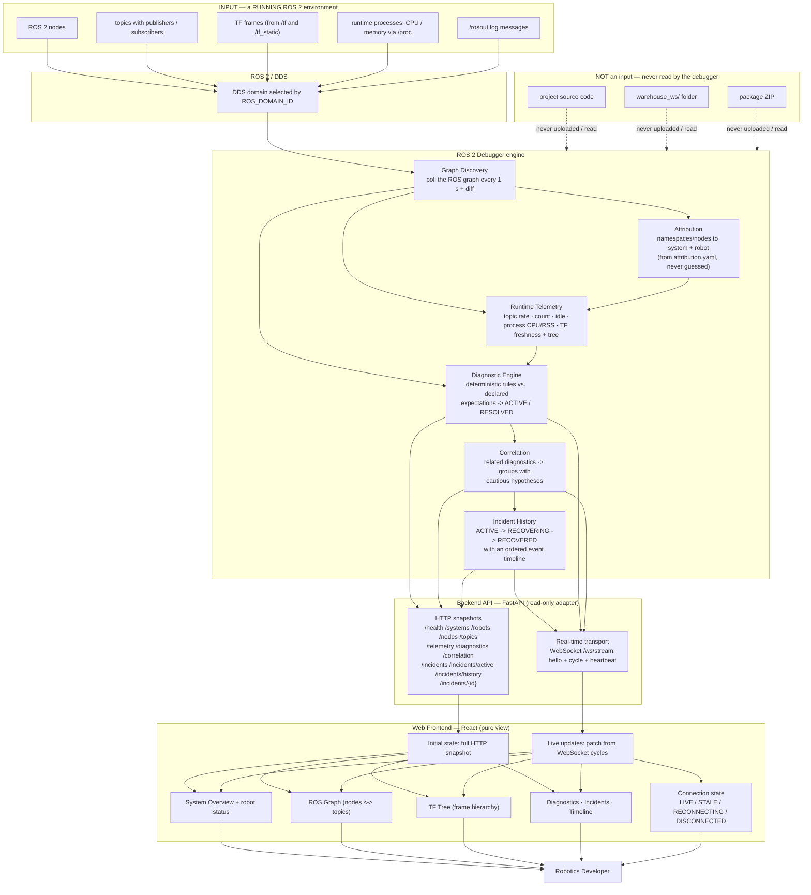

# ROS 2 Debugging Dashboard

A **ROS 2 debugging / observability platform** that sits *between* a running
ROS 2 system and the robotics developer. It observes a live ROS 2 environment,
analyzes what it finds, and surfaces an interactive dashboard that answers:

> *What exists? What belongs to what? What is happening? What is abnormal?
> What is related? What happened over time? Where should I investigate?*

```
+------------------------------------------------------+
|                  ROS 2 SYSTEM                        |
|   Robots / Nodes / Topics / TF / Runtime Resources   |
+------------------------------------------------------+
                         |
                         |  ROS 2 / DDS (observation, not modification)
                         v
+------------------------------------------------------+
|          ROS 2 DEBUGGER / OBSERVABILITY              |
|   Discovery -> Attribution -> Telemetry              |
|   Diagnostics -> Correlation -> Incident History     |
+------------------------------------------------------+
                         |
                         |  Backend API (HTTP + WebSocket)
                         v
+------------------------------------------------------+
|                  WEB DASHBOARD                       |
|   System Overview · ROS Graph · TF Tree              |
|   Diagnostics · Incidents · History · Live state     |
+------------------------------------------------------+
                         |
                         v
                 Robotics Developer
```

> **The single most important idea:** this project does **not** receive a
> project ZIP, source code, or a warehouse folder. It attaches to and observes
> a **running ROS 2 environment** and reports what it finds. The analysis is
> driven by **explicit, declared configuration** — never by guessing.

---

## Architecture — the complete picture

The following diagram is the project's data flow. If you read nothing else,
this tells you what the project is, what goes in, what happens inside, and what
comes out.



---

## What input does the debugger take?

**The debugger attaches to and observes a running ROS 2 environment.** You do
not upload `warehouse_ws/`, source code, a package ZIP, or a project folder.

The input is a **running ROS 2 environment**, which may contain:

- ROS 2 **nodes** and their names/namespaces,
- **topics** with publishers and subscribers,
- **TF frames** (published on `/tf` and `/tf_static`),
- **runtime telemetry**: topic message rates and counts, per-process CPU and
  memory, TF freshness,
- `/rosout` **log messages**,
- the **declared system layout** in `config/attribution.yaml` (see
  *Attribution* below).

The collector is a normal ROS 2 node: it joins the DDS domain selected by the
shell's `ROS_DOMAIN_ID` and observes whatever is visible there. It never
modifies the observed system and it never receives application source code.

---

## Layer-by-layer

### 1 · Input — a running ROS 2 system
A live ROS 2 environment: nodes publishing/subscribing topics, TF broadcasters,
processes consuming CPU and memory. This is the raw material. The debugger does
**not** collect services or actions — only what the implementation actually
observes: the graph, telemetry, TF, processes, and `/rosout`.

### 2 · ROS 2 / DDS
DDS provides the discovery/communication mechanism that lets the debugger
observe the environment. The debugger **observes** through DDS; it does **not**
replace DDS. What is visible is determined by the DDS **domain**
(`ROS_DOMAIN_ID`) and the graph that domain exposes.

### 3 · Graph discovery
Answers *"what currently exists?"*. A `CollectorNode` polls the ROS graph every
second and **diffs** the result, producing an event stream: nodes/topics added
or removed, publishers/subscribers appearing or disappearing. The result is a
live `GraphModel` of nodes, topics, and the relationships between them.

### 4 · Attribution
Answers *"what does this entity belong to?"*. Attribution is **not** ROS 2
discovery — it is an additional interpretation layer. Given a namespace like
`/robot2`, it decides the owner hierarchy:

```
Warehouse
   └─ Robot 2
        └─ lidar_node
             └─ /robot2/scan
```

The mapping comes **only** from `attribution.yaml` (namespaces → systems,
robots, exact node names). Anything that matches nothing stays
`UNCLASSIFIED` — never guessed. The debugger does **not** magically know "this
graph is warehouse"; it knows because the config declares it.

### 5 · Runtime telemetry
Answers *"what is happening right now?"*. Measured facts, not verdicts:

- **topic telemetry** — message rate (Hz), message count, idle time since the
  last message, QoS reliability/durability (via passive `BEST_EFFORT`
  monitoring subscriptions),
- **process telemetry** — per-process CPU % and RSS MB, sampled out-of-band
  from `/proc` (PID reuse guarded by start-time),
- **TF telemetry** — per-frame freshness and the parent/child frame tree,
  captured from the wire.

### 6 · Diagnostics
Answers *"is that abnormal?"*. Observations like *"CPU = 98%"* or
*"scan frequency = 1 Hz"* are not conclusions. The diagnostic engine applies
**deterministic rules against declared expectations** and produces verdicts
with evidence and severity:

```
Observation:   "scan frequency = 1 Hz, expected >= 8 Hz"
Diagnostic:    frequency_degradation on /robot2/scan   (ACTIVE / RESOLVED)
```

Rules include: `stale_topic`, `frequency_degradation`, `missing_publisher`,
`not_receiving`, `node_disappeared`, `tf_missing`, `tf_stale`, `high_cpu`,
`high_memory`. Recovery is first-class: a diagnostic that stops firing becomes
`RESOLVED` rather than lingering. No AI, no history, no root-cause claims.

### 7 · Correlation
Answers *"which diagnostics are related?"*. Multiple diagnostics are grouped by
shared evidence — same entity (system/robot), temporal co-occurrence, resource
pressure, or a shared subject:

```
CPU HIGH  +  SCAN DEGRADED  +  TF STALE      (same robot, ~same time)
                  ↓
          potentially related — an INCIDENT with a cautious hypothesis
```

> **CORRELATION ≠ PROVEN CAUSATION.** The engine never claims "CPU caused the
> LiDAR failure." Hypotheses are template-constrained ("resource pressure *may*
> be contributing"), confidence is qualitative (LOW/MEDIUM/HIGH), and the tests
> enforce that no causal vocabulary appears. Root cause is **not determined**.

### 8 · Incident history
Answers *"what happened over time?"*. Correlated diagnostics become stable
**incident sessions** with a lifecycle and an ordered event timeline:

```
HEALTHY → ACTIVE INCIDENT → RECOVERY (RECOVERING) → RECOVERED
```

Each session records member activations/recoveries (`ACTIVATED`/`RECOVERED`
events with timestamps), duration, and the order in which members appeared.
History is **in-memory only** — on restart it is empty by design.

### 9 · Backend API
A clean interface between the engine and the web app. The frontend never
touches ROS 2 directly:

```
ROS 2 → Debugger → Backend API → Frontend
```

`DebuggerApp` is the **single source of truth**; the API is a thin read-only
adapter over it (no second state store). It exposes typed HTTP snapshots:
`/health`, `/systems`, `/robots`, `/nodes`, `/topics`, `/telemetry`,
`/diagnostics`, `/correlation`, `/incidents` (plus `/incidents/active`,
`/incidents/history`, `/incidents/{id}`), and the real-time WebSocket below.

### 10 · Real-time transport
Phase 11 replaces the old 2-second polling with **WebSocket** push.

- **Initial state** — on connect, the frontend fetches a **full HTTP snapshot**
  and converges to the current truth.
- **Live updates** — the backend broadcasts one `cycle` per observation cycle
  carrying that cycle's diagnostic/correlation/incident transitions; the
  frontend patches its snapshot. `hello` and `heartbeat` messages provide
  liveness.
- **Re-sync** — on every (re)connect the frontend refetches the full snapshot;
  there is **no replay** of missed events. A `topology_changed` flag tells the
  frontend to refetch (structure/attribution only exists on the backend).
- **Connection state** is always visible: LIVE / STALE / RECONNECTING /
  DISCONNECTED. Polling survives only as a fallback when WebSocket is
  unavailable.

### 11 · Web frontend
A React + TypeScript dashboard that renders the backend's state. It never
judges anything — it presents what the backend decides and labels its own
connectivity honestly. Views:

- **System Overview** — systems, robots, status (HEALTHY/WARNING/CRITICAL),
  active diagnostics and incidents,
- **ROS Graph** — deterministic bipartite view of nodes ↔ topics, with problem
  entities highlighted,
- **TF Tree** — parent/child frame hierarchy with stale frames highlighted,
- **Diagnostics** — active and resolved verdicts,
- **Incidents** — active incidents and history, plus a per-incident detail page
  with the full `t+offset` timeline,
- **Telemetry** — topic rates/counts/idle, process CPU/RSS, TF frames.

### 12 · Human output
The robotics developer sees a live, trustworthy picture: what exists, what
belongs to what, what is happening, what is abnormal, what is related, what
happened over time, and where to investigate first.

---

## What this project does NOT do

This is a **boundary that is enforced by design**:

- ❌ It does **not** replace ROS 2 or DDS — it observes through them.
- ❌ It does **not** control robot hardware or send commands.
- ❌ It does **not** automatically fix robot failures.
- ❌ It does **not** guarantee root-cause determination — correlation produces
  cautious hypotheses, never causation.
- ❌ It does **not** inspect source code or magically understand an arbitrary
  project.
- ❌ It does **not** require (or accept) uploading the warehouse project's
  source code — it observes the **running** ROS 2 environment.
- ❌ It does **not** collect services/actions or stream raw sensor data (no
  `/scan` point clouds to the browser) — only verdicts and transitions.
- ❌ It does **not** persist data or authenticate users — in-memory, LAN-only,
  loopback-origin tooling (documented as future work).

---

## Multiple ROS 2 systems and domains

A ROS 2 **domain** (`ROS_DOMAIN_ID`) determines which participants can discover
each other. The debugger joins whatever domain the launching shell selects:

```
ROS_DOMAIN_ID  →  DDS domain  →  ROS 2 graph visible to the debugger
```

If two systems run in the **same** domain, their entities can appear in the
same graph. If they run in **different** domains, the debugger (like any ROS 2
node) only sees its own domain. "Project" is not inherently a ROS 2 concept —
the debugger observes a runtime environment. On top of that, this project adds
a **declared** system model (`attribution.yaml`): it does not *discover* that a
graph "is warehouse," it is *told* by configuration which namespaces belong to
which system and robot.

---

## A concrete example — the warehouse

**Running system:** Robot 1 and Robot 2 publish `/robot1/chatter`,
`/robot1/fast`, `/robot2/scan`, TF frames (`odom`, `base_link`), and a
`robot2_lidar_driver` process is consuming 95% CPU.

1. **Discovery** — the collector sees the nodes, topics, and their endpoints.
2. **Attribution** — `/robot2/scan`'s publisher maps to `warehouse/robot2/lidar`.
3. **Telemetry** — `/robot2/scan` is receiving at ~1 Hz (expected ≥ 8 Hz);
   `base_link` TF went stale; the process CPU reads 95%.
4. **Diagnostics** — rules fire: `frequency_degradation` on `/robot2/scan`,
   `tf_stale` on `base_link`, `high_cpu` on `robot2_lidar_driver`.
5. **Correlation** — the three diagnostics share the entity
   `warehouse/robot2` and a time window → **one possible related incident**,
   with the cautious hypothesis "resource pressure *may* be contributing."
6. **Incident history** — the incident session records when each member
   activated, and later when each recovered.
7. **Backend API + WebSocket** — the snapshot and live `cycle` messages carry
   the verdicts and transitions to the frontend.
8. **Dashboard** — the developer sees:

```
Robot 2 — DEGRADED        (live, not polled)
ACTIVE INCIDENT           evidence: CPU high · /scan degraded · TF stale
/robot2/scan · base_link  highlighted in the ROS Graph and TF Tree
```

---

## Running the dashboard

Prerequisites: a sourced ROS 2 (e.g. Jazzy), `colcon`, Node.js/npm.

**Terminal 1 — backend:**

```bash
cd ~/ros2_debugger
source /opt/ros/jazzy/setup.bash
colcon build --symlink-install
source install/setup.bash

# demo state (no robot needed):
ros2 run ros2_debugger debugger-api --no-ros --demo

# live robot (joins your ROS_DOMAIN_ID domain):
ros2 run ros2_debugger debugger-api
```

**Terminal 2 — frontend:**

```bash
cd ~/ros2_debugger/web
npm run dev
```

Open **http://localhost:5173**. The header badge shows **LIVE** and updates in
real time. Run the warehouse system in another terminal on the **same**
`ROS_DOMAIN_ID` to populate the dashboard. A terminal CLI also exists:
`ros2 run ros2_debugger debugger`.

---

## Configuration

Everything the engine *judges* is declared in `config/attribution.yaml`:
systems/robots/namespaces, monitored topics and processes, diagnostic
expectations (`min_hz`, `stale_after_s`, `required_tf_frames`,
`process_thresholds`), and correlation tuning. The engine never assumes health
thresholds; a subject is only judged when an expectation exists.

---

## Tests & repository layout

- **Backend** (`test/`, pytest): 89 tests — discovery/attribution, telemetry,
  diagnostics, correlation, history, the API, and the WebSocket stream.
- **Frontend** (`web/src/*.test.ts(x)`, Vitest): 39 tests — patch logic,
  connection state machine, routed views, API contract.
- `ros2_debugger/` — engine + API (`broadcast.py`, `collector.py`,
  `attribution.py`, `telemetry.py`, `diagnostics.py`, `correlation.py`,
  `history.py`, `app.py`, `api.py`, `debugger.py`).
- `web/` — the React dashboard.
- `docs/` — `design.md` (full design history), `phase-N/concepts.md`
  (concept documents), `interview-questions.md`.
- `test/` — backend tests.

---

## More reading

- `docs/design.md` — the architecture decisions behind every phase.
- `docs/phase-N/concepts.md` — concept documents written for a robotics
  engineer (e.g. `docs/phase-11/concepts.md` for the real-time transport).
- The five-layer contract: **observation ≠ diagnostic ≠ correlation ≠
  hypothesis ≠ root cause** — this is the project's central guarantee, and it
  is enforced by construction at every layer.
